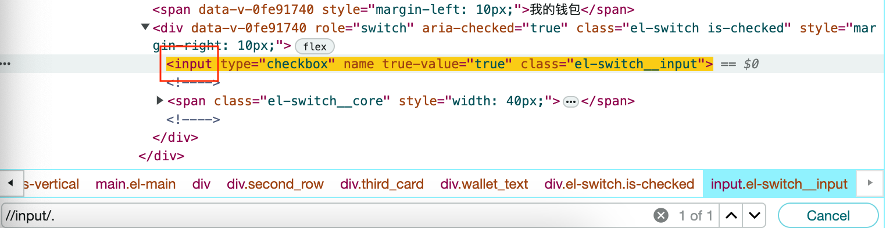
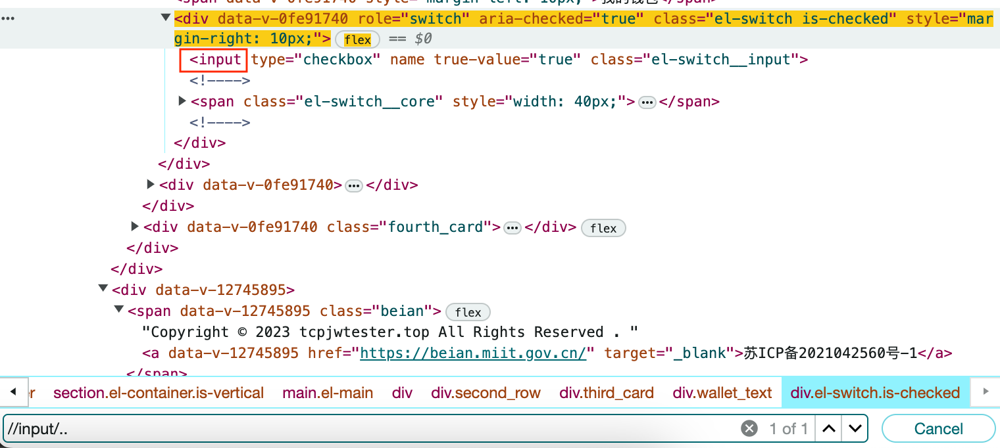
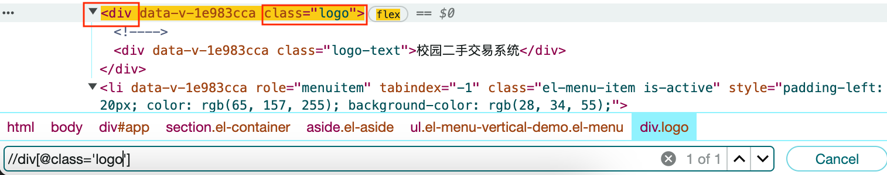
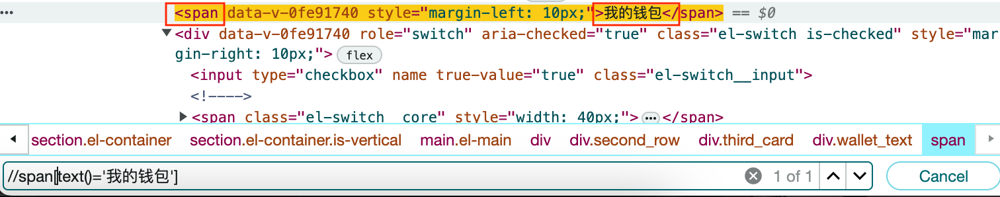
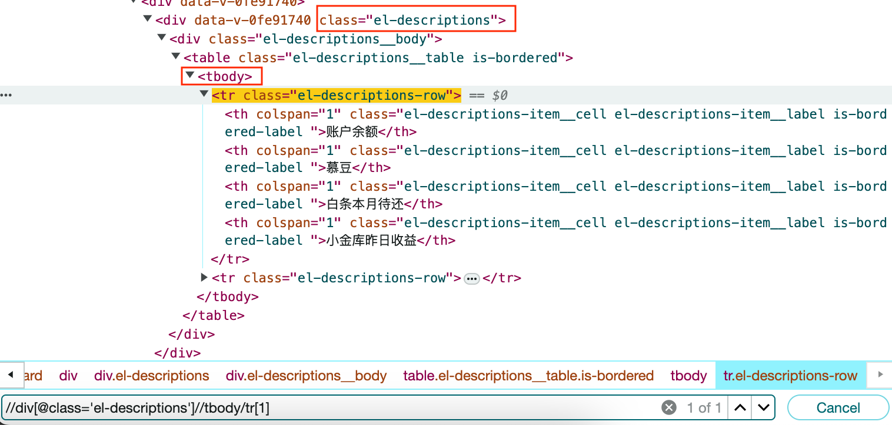
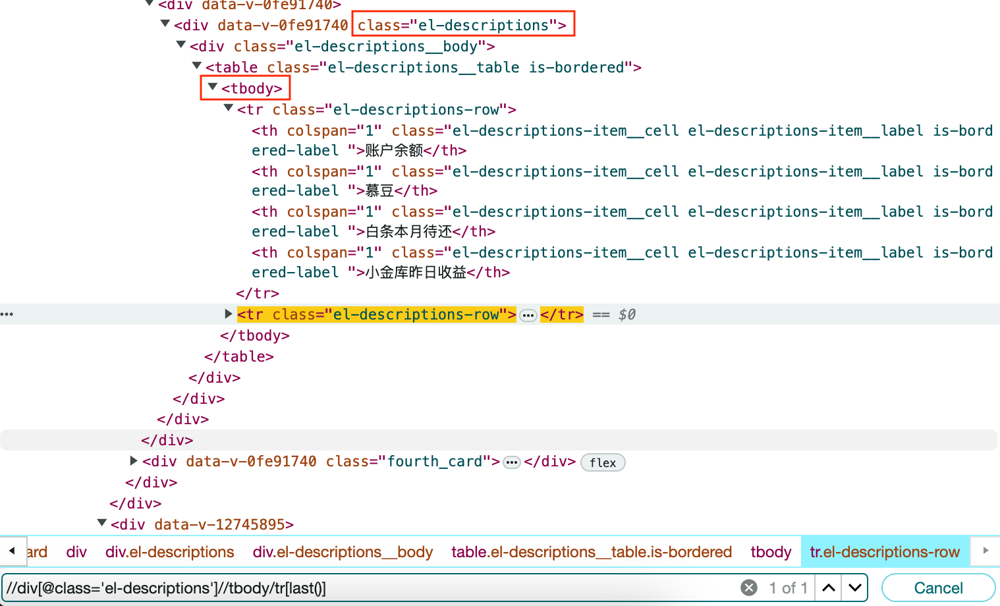
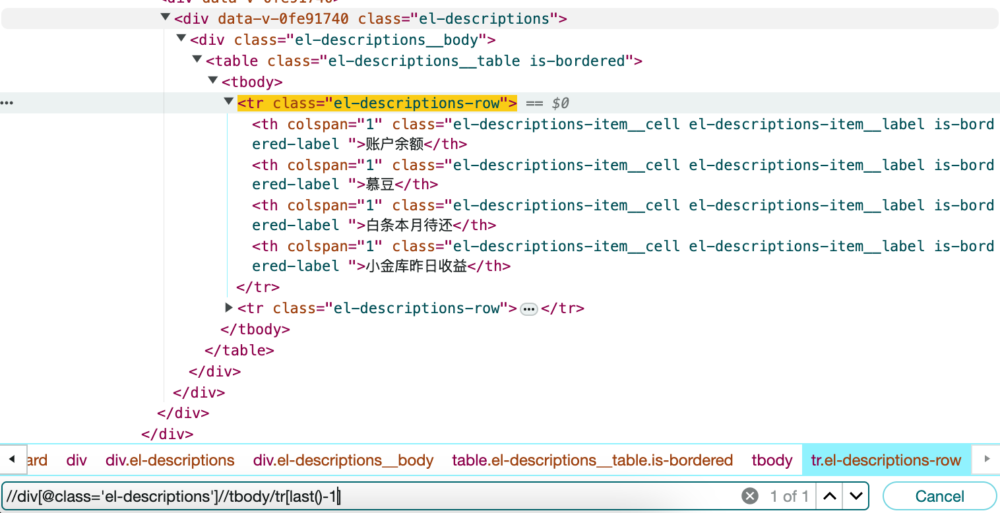

# Xpath查找

### 两种查找模式

1. 从根节点开始查找 /
2. 模糊查找 //

### 示例

1. . 选取当前节点
   
2. .. 选取当前节点的父节点
   

3. //div[@class='logo'] 选取标签名为div，属性class值为logo元素
   

4. //span[text=('我的钱包')] 选取所有标签为span，span标签的文字内容为‘我的钱包的元素’
   

5. //div[@class='el-descriptions']//tbody/tr[1] 选取tbody下的第一个tr
   

6. //div[@class='el-descriptions']//tbody/tr[last()] 选取tbody的最后一个tr
   

7. //div[@class='el-descriptions']//tbody/tr[last()-1]选取tdoby的倒数第二个tr
   

