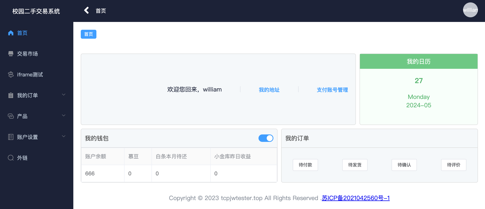
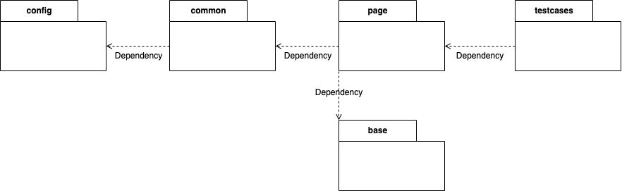

# Trading System Automation Test System(In Progress)

## 概述
**测试对象**：Trading System。该系统共有7个模块，分别为“登录模块”，“首页模块”，“交易市场”，“iframe测试”，“我的订单”，“产品”，“账户设置”

**Trading System Automation Test System**：围绕“校园二手商品交易系统”的7大模块，采用PO模式将系统分为base，page，testcases三层，使用Python+Selenium+Allure+Jenkins实现。

## Trading System 

## 系统架构
### Trading System Automation Test Architecture

* base：存放元素定位，selenium二次封装的方法
* page：存放具体页面的元素操作，比如登录页面，商品详情页面
* testcases：存放测试用例
* common：存放通用工具，比如获取当前时间，获取目录项地址等
* config：存放配置文件，以及驱动
* logs：存放日志

### Page Object
整套系统采用Page Object模式，定义了base，page和testcases三个包
* base：存放元素定位，selenium二次封装的方法
* page：存放具体页面的元素操作，比如登录页面，商品详情页面
* testcases：存放测试用例

## Reference 
* [Page Object](https://martinfowler.com/bliki/PageObject.html)
